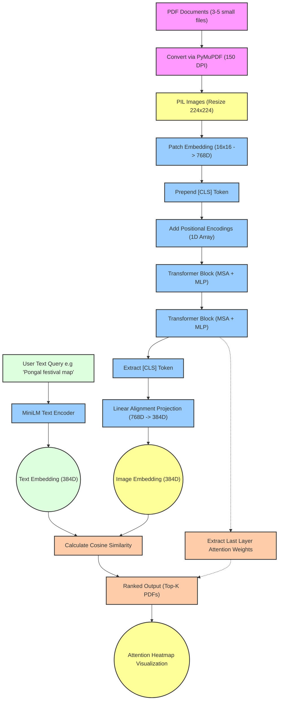

# Visual Document Retrieval Using Vision Transformers

A Deep Learning educational baseline project that implements a Vision Transformer (ViT) from scratch to perform visual document retrieval. Inspired by modern vision-language models like ColPali, this project treats PDF documents holistically as images to preserve document layout, charts, and spatial features, matching them against text queries using a custom, lightweight ViT.

## Problem Statement

Traditional document search heavily relies on OCR (Optical Character Recognition) to extract text, convert it to embeddings, and perform semantic search. However, this approach completely loses crucial visual and layout information. For example:
- The spatial relationship between a chart and its caption.
- The 2D structure of tables.
- Visual cues like font sizing, bolding, or positional emphasis.
- OCR errors propagate down the pipeline, ruining search results.

**The Core Challenge:** How can Transformers process PDF documents holistically using global self-attention while preserving their 2D spatial relationships?

## Optimal Methodology and Approach

This project bypasses OCR entirely. We adopt an image-centric approach:
1. **Visual Ingestion**: PDF pages are directly converted into high-resolution images.
2. **Patch Embeddings**: The image is broken down into 16x16 patches. A trainable linear projection maps these raw pixel patches into dense embeddings.
3. **Positional Encodings**: To prevent the Transformer from treating the patches as a disordered "bag of words," we inject 1D positional encodings, allowing the model to inherently learn 2D layout distances.
4. **Self-Attention & ViT**: A computationally efficient 2-4 layer from-scratch Vision Transformer processes the sequence. Multi-Head Attention allows different heads to focus on different aspects (e.g., text, charts, spatial structure). The scaling factor (`1/sqrt(d_k)`) stabilizes gradient flow.
5. **Cross-Modal Retrieval**: We project the final `[CLS]` token embedding of the ViT into the same vector space as a frozen lightweight text encoder (`MiniLM`). Documents are ranked against a user query using pure Cosine Similarity.
6. **Interpretability**: By extracting the Multi-Head Attention weights from the final Transformer layer, we overlay a heatmap on the original document to visually interpret exactly *where* the model was looking to satisfy a given query.

## Framework and Architecture Diagrams

### System Architecture

The following diagram tracks the macro-level data flow, from raw PDF ingestion to Query matching and Heatmap Visualization.



### Vision Transformer Detailed Block

A localized view of how input token representations are dynamically routed through Self-Attention and Multi-Layer Perceptrons.

```mermaid
flowchart TD
    classDef input fill:#ddd,stroke:#333,stroke-width:2px;
    classDef norm fill:#d1e7dd,stroke:#333,stroke-width:2px;
    classDef attention fill:#cff4fc,stroke:#333,stroke-width:2px;
    classDef mlp fill:#f8d7da,stroke:#333,stroke-width:2px;
    classDef output fill:#ddd,stroke:#333,stroke-width:2px;
    
    Input["Input Tokens (B, N, D)"]:::input --> Norm1["Layer Normalization"]:::norm
    Norm1 --> MHA["Multi-Head Self-Attention"]:::attention
    
    %% MHA Breakdown
    MHA -->|Generate| Q["Queries (Q)"]:::attention
    MHA -->|Generate| K["Keys (K)"]:::attention
    MHA -->|Generate| V["Values (V)"]:::attention
    Q & K -->|Q * K^T / sqrt(d_k)| Scores["Attention Scores"]:::attention
    Scores --> Softmax["Softmax"]:::attention
    Softmax & V -->|Multiply| WeightedV["Weighted Values"]:::attention
    WeightedV --> ConcatHeads["Concatenate Parallel Heads -> Linear Projection"]:::attention
    ConcatHeads --> AttentionOut
    
    %% Residuals
    Input -->|Residual Connection (+)| AttentionOut["Add Attention to Input"]:::attention
    
    %% MLP Block
    AttentionOut --> Norm2["Layer Normalization"]:::norm
    Norm2 --> FeedForward1["Linear Layer (Scale D -> 4D) + GELU"]:::mlp
    FeedForward1 --> FeedForward2["Linear Layer (Scale 4D -> D)"]:::mlp
    
    %% Residuals
    AttentionOut -->|Residual Connection (+)| OutputTokens["Add MLP output to Residual"]:::output
    FeedForward2 --> OutputTokens
```

## Setup and Execution

### 1. Requirements

Ensure you have Python 3.8+ installed. Install the dependencies via:

```bash
pip install -r requirements.txt
```

### 2. Prepare Sample Dataset

For this educational baseline, we have included a script to synthetically generate a small dataset of dummy PDF documents containing test layouts about Chennai / Tamil Nadu.

```bash
python create_dummy_pdfs.py
```

### 3. Run the Framework

Execute the main orchestrator script. This script will instantiate the PyTorch modules, run an InfoNCE contrastive training loop over the generated PDFs to rapidly align the Image embeddings with Text queries, perform a sample query execution, and display the Matplotlib visual heatmaps.

```bash
python main.py
```

## Repository Structure

- `src/model.py`: Scratch-built core Vision Transformer blocks (PatchEmbedding, PositionalEncoding, MultiHeadAttention, ViTEncoder).
- `src/dataset.py`: PDF handling and PIL conversion utilizing PyMuPDF.
- `src/retrieval.py`: Setup for MiniLM text embedding and cosine similarity ranking.
- `src/train.py`: InfoNCE logic for contrastively aligning visual and textual representations.
- `src/visualize.py`: Heatmap interpolation and formatting functions.
- `main.py`: Entry point for simulation block.
- `create_dummy_pdfs.py`: Script to generate quick synthetic datasets.
